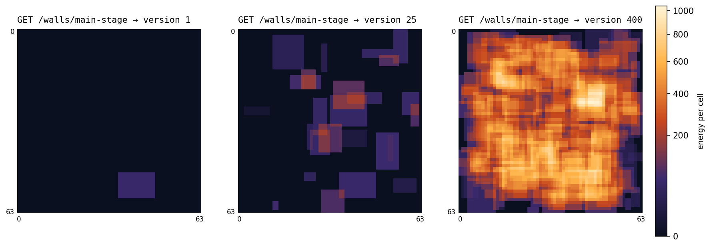
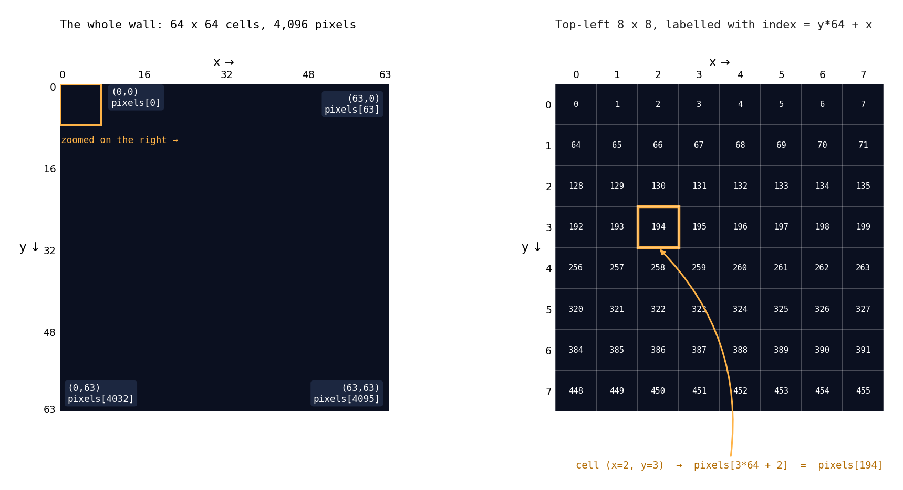
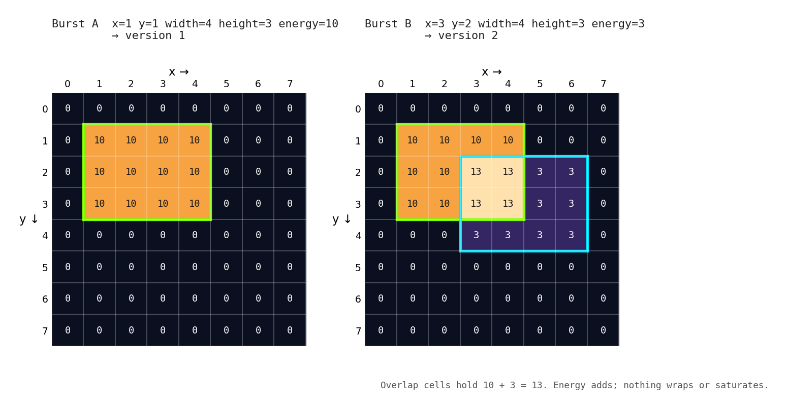
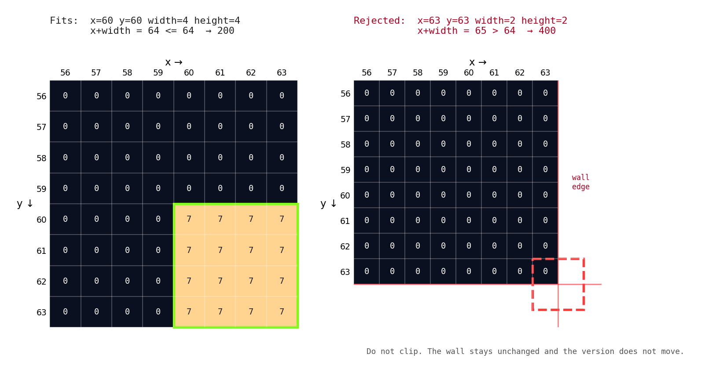
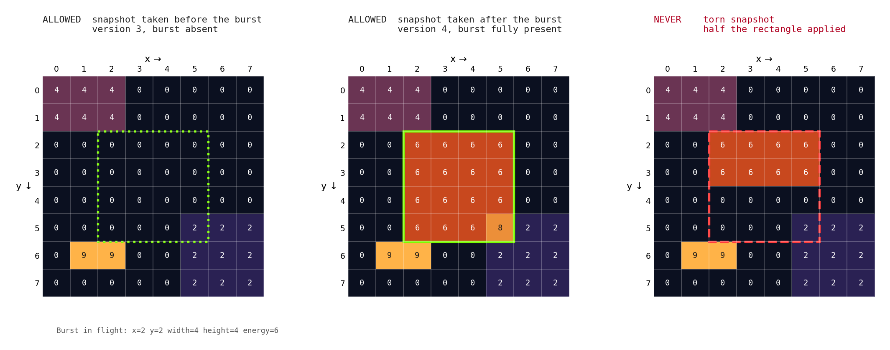
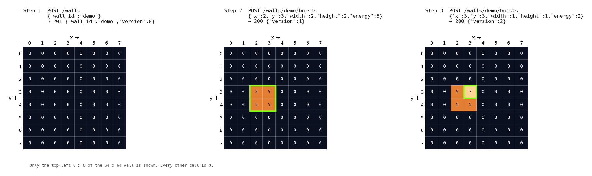

# Firefly Concert — a concurrent light-wall server



*One wall, read three times. Every burst adds energy to a rectangle of cells. Every read returns
all 4,096 cells and the version they belong to.*

## Contents

- [Your task](#your-task)
- [Your choice of stack is part of the problem](#your-choice-of-stack-is-part-of-the-problem)
- [AI assistance: coding only](#ai-assistance-coding-only)
- [The model](#the-model)
- [How to run your submission](#how-to-run-your-submission)
- [HTTP conventions](#http-conventions)
- [Endpoints](#endpoints)
  - [1. Create a wall](#1-create-a-wall)
  - [2. Add a burst](#2-add-a-burst)
  - [3. Read a snapshot](#3-read-a-snapshot)
- [Worked example with exact values](#worked-example-with-exact-values)
- [Suggested implementation milestones](#suggested-implementation-milestones)
- [Run the grader](#run-the-grader)

## Your task

Imagine a concert where audience members tap their phones to send rectangular bursts of light
to a giant wall. Other clients repeatedly fetch the wall to display it. Implement the HTTP
server that accepts those bursts and returns the current state.

Deliver working code, a command to start it on a specified port, and a short explanation of
your design. Aim for 90 minutes of implementation followed by 20 minutes of discussion. Store
state in memory in one server process.

You do **not** need a UI, authentication, persistence, WebSockets, animation, decay, distributed
storage, or retry deduplication. The challenge is correct shared state under concurrent requests
and fast HTTP responses.

## Your choice of stack is part of the problem

Use any language, runtime, and framework. None is required or recommended, but the choice
matters, and it is yours to make and defend.

**Performance is part of the score.** Speed is 30 of the 100 points, and the grader offers
10,000 requests per second whether or not your server keeps up. How much of that one server
process can absorb depends heavily on the stack underneath your code:

- how many CPU cores can run your request handlers at the same time;
- how much work each request costs before your code even runs (parsing, framework,
  interpreter or runtime overhead, JSON encoding of 4,096 integers);
- whether garbage collection, a shared thread, or queued work adds pauses that show up in p99.

**The stack also changes how hard the problem is.** Where handlers truly run in parallel, you
must protect shared state yourself, and a mistake shows up as torn snapshots or lost updates.
Where handlers run one at a time, correctness is easier to reach, but every request shares
that one thread: a slow snapshot delays everyone behind it, and throughput stops at what one
core can do. A stack that makes the code simple can cap your speed points; a stack that raises
the ceiling can make correctness harder to get right in 90 minutes.

There is no single right answer. Pick deliberately, and be ready to explain what your choice
bought you, what it cost you, and where it limited your score. The interviewer weighs your
result with that tradeoff in mind.

## AI assistance: coding only

You may use an AI coding assistant (Claude Code, Codex, Cursor, Copilot, or similar) to write
code. You may not use it for the parts being evaluated. Those are yours:

- choosing your language, runtime, and framework;
- choosing the synchronization design and explaining why it is correct;
- running the grader and interpreting its output, finding the bottleneck, and choosing
  what to optimize;
- writing `NOTES.md`;
- the discussion afterward.

Before you start, load the supplied rules into your assistant and show the interviewer that
it has picked them up:

| Assistant | Rules location |
|---|---|
| Claude Code | `CLAUDE.md` and `.claude/settings.json` are already in this folder; start it here |
| Codex, Cursor, and others that read `AGENTS.md` | `AGENTS.md` is already in this folder |
| Anything else | paste `AGENTS.md` as the first message or the system prompt |

Direct the assistant the way you would direct a fast pair who types for you. Tell it the
design in your own words ("one lock per wall; copy pixels and version under it; serialize
after unlocking") and it will implement it. Run the grader yourself in your own terminal.
Share your screen for the whole session and submit the assistant's transcript (for example
`/export` in Claude Code) with your code. Using the assistant for a forbidden task counts
against the submission even when the code scores well.

## The model

- Each wall is a separate 64 × 64 grid of integer energy values. All values initially equal 0.
- Coordinates start at `(0,0)` in the top-left. X increases rightward; Y increases downward.
- A wall starts at version 0. Every successful burst increases its version by exactly 1.
- A burst adds its energy to each cell in a rectangle. Values add without wrapping or saturation.
- The server assigns versions. Clients do not send them.
- Walls are independent. Updating one must not change any other.
- The grader keeps all pixel values and versions below 2^31.

### Coordinates and pixel indexing



```text
Wall:    64 columns (x = 0..63) by 64 rows (y = 0..63)  =  4,096 cells
Origin:  (0,0) is the top-left cell. x grows to the right, y grows downward.

pixels[index]    where    index = y * 64 + x

(x=0,  y=0)   -> pixels[0]        top-left
(x=63, y=0)   -> pixels[63]       top-right
(x=0,  y=63)  -> pixels[4032]     bottom-left
(x=63, y=63)  -> pixels[4095]     bottom-right
(x=2,  y=3)   -> pixels[194]      3 * 64 + 2
```

### What a burst does

A burst names a rectangle by its top-left corner `(x, y)`, its `width`, its `height`, and an
`energy`. The server adds `energy` to every cell inside that rectangle and raises the wall's
version by one.



```text
Burst A:  {"x":1,"y":1,"width":4,"height":3,"energy":10}    -> version 1
Burst B:  {"x":3,"y":2,"width":4,"height":3,"energy":3}     -> version 2

A burst covers every cell where   x <= cell_x < x + width   and   y <= cell_y < y + height

After A                            After A and B
   x:  0  1  2  3  4  5  6  7         x:  0  1  2  3  4  5  6  7
y=0    0  0  0  0  0  0  0  0      y=0    0  0  0  0  0  0  0  0
y=1    0 10 10 10 10  0  0  0      y=1    0 10 10 10 10  0  0  0
y=2    0 10 10 10 10  0  0  0      y=2    0 10 10 13 13  3  3  0
y=3    0 10 10 10 10  0  0  0      y=3    0 10 10 13 13  3  3  0
y=4    0  0  0  0  0  0  0  0      y=4    0  0  0  3  3  3  3  0
y=5    0  0  0  0  0  0  0  0      y=5    0  0  0  0  0  0  0  0
```

Values simply add. Cells inside both rectangles hold 10 + 3 = 13. Nothing wraps or saturates.

## How to run your submission

Provide your startup command. It must accept the port as an argument, for example:

```sh
<your start command> --port 8765
```

## HTTP conventions

These rules apply to every endpoint.

| Rule | Requirement |
|---|---|
| Bind address | `127.0.0.1`, on the port given on the command line |
| Protocol | HTTP/1.1 with persistent (keep-alive) connections, or later |
| Response `Content-Type` | `application/json` on every response, including errors |
| Response framing | Every response is correctly framed with `Content-Length` or chunked encoding |
| Request bodies | UTF-8 JSON. The grader always sends a valid `Content-Length` header |
| JSON formatting | Whitespace and object-key order do not matter |
| Response shape | Exactly the fields listed for the endpoint, at the top level. Never wrap a response in another object |
| Unknown request fields | Ignored |
| State | Held in memory in one server process. Restarting the server clears every wall |

Out of scope, and never sent by the grader: methods other than the ones listed below, query
parameters, percent-encoded path characters, HTTP pipelining, chunked request bodies, and
bodies larger than 8 KiB.

## Endpoints

Implement exactly three routes.

| # | Method | Path | Purpose | Success status |
|---|---|---|---|---|
| 1 | `POST` | `/walls` | Create an empty wall | 201 |
| 2 | `POST` | `/walls/{wall_id}/bursts` | Add energy to a rectangle of one wall | 200 |
| 3 | `GET` | `/walls/{wall_id}` | Read a consistent snapshot of one wall | 200 |

### Wall IDs

```text
wall_id:   1 to 64 characters, each one of   A-Z   a-z   0-9   _   -
regex:     ^[A-Za-z0-9_-]{1,64}$

valid:     main-stage    stage_2    abc    MAIN    x
invalid:   ""  (empty)      "main stage"  (space)      "stage/2"  (slash)      65+ characters
```

The same alphabet applies whether the ID appears in a JSON body or as `{wall_id}` in a path.
A path ID outside the alphabet can never name an existing wall, so it falls under the 404 rule
below.

### Error responses

Every error body is a JSON object with one field, `error`.

| Status | Body | Returned when |
|---|---|---|
| 404 | `{"error":"not_found"}` | The route is unknown, or `{wall_id}` in the path does not exist |
| 400 | `{"error":"invalid_request"}` | The body is not valid JSON, is not an object, is missing a required field, has a field of the wrong type or out of range, or describes a rectangle that does not fit |
| 409 | `{"error":"already_exists"}` | A valid create request names a wall that already exists |

When more than one rule applies, use this order:

```text
1. 404 first     Nonexistent wall or unknown route. Wins even when the body is malformed.
2. 400 second    Validate the body only after the route and the wall resolve.
3. 409 last      A create request conflicts only after its body passes validation.
```

A rejected request must leave every wall's pixels and version unchanged.

### Numeric fields

```text
Every required numeric field must be a JSON integer token.

valid:      1
invalid:    1.0    1e0    true    null    "1"        -> 400 invalid_request

Missing required field   -> 400 invalid_request
Unknown extra field      -> ignored, no error
```

Valid JSON has no NaN or Infinity tokens, so you never need to handle them.

### 1. Create a wall

**Route**

```text
POST /walls
```

**Request body**

```json
{"wall_id":"main-stage"}
```

| Field | Type | Required | Constraint |
|---|---|---|---|
| `wall_id` | string | yes | 1–64 characters matching `[A-Za-z0-9_-]+` |

**Responses**

| Status | Returned when | Body |
|---|---|---|
| 201 | The ID was free and the wall was created | `{"wall_id":"main-stage","version":0}` |
| 409 | The ID already exists | `{"error":"already_exists"}` |
| 400 | The body is invalid | `{"error":"invalid_request"}` |

**Fields in the 201 body**

| Field | Type | Value |
|---|---|---|
| `wall_id` | string | The ID that was created |
| `version` | integer | Always `0` for a new wall |

**Full exchange**

```http
POST /walls HTTP/1.1
Host: 127.0.0.1:8765
Content-Type: application/json
Content-Length: 24

{"wall_id":"main-stage"}
```

```http
HTTP/1.1 201 Created
Content-Type: application/json
Content-Length: 36

{"wall_id":"main-stage","version":0}
```

The same request sent a second time:

```http
HTTP/1.1 409 Conflict
Content-Type: application/json
Content-Length: 26

{"error":"already_exists"}
```

**Behavior**

- A new wall is a 64 × 64 grid with every cell at 0 and version 0.
- A 409 must not reset or otherwise change the existing wall.
- Creation must be atomic under concurrency. If eight clients create the same ID at the same
  time, exactly one receives 201 and the other seven receive 409.

```text
8 clients at the same instant:   POST /walls   {"wall_id":"main-stage"}

client 1  -> 201  {"wall_id":"main-stage","version":0}
client 2  -> 409  {"error":"already_exists"}
client 3  -> 409  {"error":"already_exists"}
   ...
client 8  -> 409  {"error":"already_exists"}

Exactly one 201. Never zero, never two.
```

### 2. Add a burst

**Route**

```text
POST /walls/{wall_id}/bursts
```

| Path parameter | Constraint |
|---|---|
| `wall_id` | Must name an existing wall, otherwise 404 |

**Request body**

```json
{"x":2,"y":3,"width":2,"height":2,"energy":5}
```

| Field | Type | Required | Range | Meaning |
|---|---|---|---|---|
| `x` | integer | yes | 0 through 63 | Column of the rectangle's left edge |
| `y` | integer | yes | 0 through 63 | Row of the rectangle's top edge |
| `width` | integer | yes | 1 through 64 | Number of columns covered |
| `height` | integer | yes | 1 through 64 | Number of rows covered |
| `energy` | integer | yes | 1 through 100 | Amount added to every covered cell |

The rectangle must fit on the wall:

```text
x + width  <= 64
y + height <= 64
```

Reject a rectangle that extends past the edge with 400. Do not clip it.



**Responses**

| Status | Returned when | Body |
|---|---|---|
| 200 | The burst was applied | `{"version":1}` |
| 404 | `{wall_id}` does not exist. Checked before the body | `{"error":"not_found"}` |
| 400 | A field is missing or invalid, or the rectangle does not fit | `{"error":"invalid_request"}` |

**Fields in the 200 body**

| Field | Type | Value |
|---|---|---|
| `version` | integer | The wall version assigned to this specific burst |

**Full exchange**

```http
POST /walls/main-stage/bursts HTTP/1.1
Host: 127.0.0.1:8765
Content-Type: application/json
Content-Length: 45

{"x":2,"y":3,"width":2,"height":2,"energy":5}
```

```http
HTTP/1.1 200 OK
Content-Type: application/json
Content-Length: 13

{"version":1}
```

Rejected examples. Each one leaves the wall and its version untouched:

```text
{"x":63,"y":63,"width":2,"height":2,"energy":1}    -> 400   x + width = 65 > 64
{"x":2,"y":3,"width":2.0,"height":2,"energy":5}    -> 400   2.0 is not an integer token
{"x":2,"y":3,"width":2,"height":2}                 -> 400   energy is missing
{"x":2,"y":3,"width":2,"height":2,"energy":0}      -> 400   energy below 1
{"x":2,"y":3,"width":2,"height":2,"energy":101}    -> 400   energy above 100
{"x":"2","y":3,"width":2,"height":2,"energy":5}    -> 400   "2" is a string
not json at all                                    -> 400   body does not parse
[1,2,3]                                            -> 400   body is not an object

POST /walls/no-such-wall/bursts   with any body    -> 404   the wall check comes first
```

The 400 body is always the same:

```http
HTTP/1.1 400 Bad Request
Content-Type: application/json
Content-Length: 27

{"error":"invalid_request"}
```

**Behavior**

- Add `energy` to every cell where `x <= cell_x < x + width` and `y <= cell_y < y + height`.
  The example body updates exactly `(2,3)`, `(3,3)`, `(2,4)`, and `(3,4)`.
- Values add without wrapping or saturation. The grader keeps all values below 2^31.
- Apply the whole rectangle and increment the version as one atomic step.
- The server assigns versions. Clients never send them.
- Repeated identical requests are separate bursts, each with its own version.
- If N bursts succeed on a new wall, the returned versions are exactly the integers 1 through
  N, each once. Responses may arrive in a different order from the versions.
- A burst on one wall never changes any other wall.

```text
Three clients burst a fresh wall at the same time. Any assignment of 1, 2, 3 is correct,
as long as each version is handed out exactly once:

client A  -> 200  {"version":2}
client B  -> 200  {"version":1}
client C  -> 200  {"version":3}
```

### 3. Read a snapshot

**Route**

```text
GET /walls/{wall_id}
```

| Path parameter | Constraint |
|---|---|
| `wall_id` | Must name an existing wall, otherwise 404 |

**Request body**

None.

**Responses**

| Status | Returned when | Body |
|---|---|---|
| 200 | The wall exists | `{"version":2,"pixels":[0,0,…,0]}` with exactly 4,096 pixels |
| 404 | `{wall_id}` does not exist | `{"error":"not_found"}` |

**Fields in the 200 body**

| Field | Type | Value |
|---|---|---|
| `version` | integer | The wall's current version |
| `pixels` | array of exactly 4,096 non-negative integers | Every cell in row-major order: index = `y * 64 + x` |

**Full exchange**

```http
GET /walls/main-stage HTTP/1.1
Host: 127.0.0.1:8765
```

```http
HTTP/1.1 200 OK
Content-Type: application/json
Content-Length: 8216

{"version":1,"pixels":[0,0,0,0, ... 4,096 integers in total ... ,0,0]}
```

A compact snapshot of an all-zero wall is 8,216 bytes. The load phase asks for about 2,500 of
them per second, so the cost of building and sending this body is part of your score.

Shape of the body for the wall above, after the one burst at `x=2 y=3 width=2 height=2`.
Comments on the right are for reading only and are not part of the JSON:

```text
{
  "version": 1,
  "pixels": [
    0, 0, 0, 0, ... 64 values ...,           row y=0    indices    0 ..   63
    0, 0, 0, 0, ... 64 values ...,           row y=1    indices   64 ..  127
    0, 0, 0, 0, ... 64 values ...,           row y=2    indices  128 ..  191
    0, 0, 5, 5, 0, ... 60 more zeros ...,    row y=3    indices  192 ..  255    194 and 195 are 5
    0, 0, 5, 5, 0, ... 60 more zeros ...,    row y=4    indices  256 ..  319    258 and 259 are 5
    ...
    0, 0, 0, 0, ... 64 values ...            row y=63   indices 4032 .. 4095
  ]
}
```

**Behavior**

- `pixels` is one flat array that includes every zero. It is not 64 nested arrays, a sparse
  map, an image, an encoded blob, or a total.
- The version and all 4,096 pixels must come from the same state. A concurrent burst may
  appear entirely applied or entirely absent, never partially.
- A read that starts after a client receives a successful burst response must include that burst.
- Sequential reads from one client must never see the version go backward.
- Walls need no shared ordering with each other.
- A simple per-wall lock is a valid starting point.



```text
A burst of energy 6 on the rectangle x=2 y=2 width=4 height=4 is in flight.
A snapshot taken at the same moment must be one of these two:

ALLOWED    version 3, none of the 16 cells changed         the read landed before the burst
ALLOWED    version 4, all 16 cells increased by 6          the read landed after the burst

NEVER      some of the 16 cells changed and some not
NEVER      version 4 but cells still missing the burst
NEVER      version 3 but cells already showing the burst
```

## Worked example with exact values

For a fresh wall `demo`:

| Step | Request | Expected response |
|---|---|---|
| 1 | `POST /walls` with `{"wall_id":"demo"}` | 201, `{"wall_id":"demo","version":0}` |
| 2 | Burst `{"x":2,"y":3,"width":2,"height":2,"energy":5}` | 200, `{"version":1}` |
| 3 | Burst `{"x":3,"y":3,"width":1,"height":1,"energy":2}` | 200, `{"version":2}` |
| 4 | `GET /walls/demo` | 200, version 2, exactly the pixels below |
| 5 | Burst `{"x":63,"y":63,"width":2,"height":2,"energy":1}` | 400, `{"error":"invalid_request"}` |
| 6 | `GET /walls/demo` | Exactly the same JSON values as step 4 |



After step 4, the top-left 8 × 8 corner of the wall holds these values. Every cell outside it is 0.

```text
       x:  0  1  2  3  4  5  6  7
  y=0      0  0  0  0  0  0  0  0
  y=1      0  0  0  0  0  0  0  0
  y=2      0  0  0  0  0  0  0  0
  y=3      0  0  5  7  0  0  0  0      pixels[194]=5   pixels[195]=7
  y=4      0  0  5  5  0  0  0  0      pixels[258]=5   pixels[259]=5
  y=5      0  0  0  0  0  0  0  0
  y=6      0  0  0  0  0  0  0  0
  y=7      0  0  0  0  0  0  0  0
```

At step 4, pixels 194, 258, and 259 equal 5; pixel 195 equals 7; all other pixels equal 0.
The sum of all pixel values is 22. The full expected JSON is supplied in `example_snapshot.json`.

## Suggested implementation milestones

1. Start an HTTP server. Implement wall creation and a snapshot of 4,096 zeros.
2. Add validation and rectangle updates. Check the worked example and boundary cases.
3. Protect the wall registry against concurrent creation. Protect each wall's pixels and version
   together. One lock per wall is enough for a correct initial implementation.
4. Copy the pixels and version while holding that lock. Serialize the copy after releasing it,
   so slow network responses do not hold the wall lock. Other correct designs are welcome.
5. Run the correctness suite. Fix correctness before optimizing.
6. Run the load benchmark. Measure before changing data structures or concurrency strategy.

Do not assume that your runtime or framework makes shared state atomic, whether it runs
handlers on many threads, on one event loop, or some other way. Explain which operation
establishes the order of concurrent updates and how a snapshot remains internally consistent.

## Run the grader

The grader is a prebuilt program in `grader/bin/`; pick the binary for your machine. It is the
same for every stack. Its source is in `grader/` if you want to read exactly what it checks.
Start your server, then:

```sh
grader/bin/firefly-grader-darwin-arm64 --url http://127.0.0.1:8765 --correctness-only
grader/bin/firefly-grader-darwin-arm64 --url http://127.0.0.1:8765 --runs 1   # quick speed check
grader/bin/firefly-grader-darwin-arm64 --url http://127.0.0.1:8765            # scored: 30 runs
```

Other binaries: `-darwin-amd64`, `-linux-amd64`, `-linux-arm64`, `-windows-amd64.exe`. On macOS,
if Gatekeeper blocks the binary, run `xattr -d com.apple.quarantine grader/bin/*` once.

The grader creates fresh IDs on every run. It tests exact output, validation, creation races,
concurrent snapshots, and final-state correctness. Failures produce a named check and diagnostic.

The load phase offers **10,000 requests per second** for 3 seconds per workload, spread over 64
keep-alive connections, whether or not your server keeps up. It runs two workloads: one shared
wall and four independent walls, each 75% bursts and 25% snapshots. It reports successful
requests/second and read/write latency p50, p95, and p99. When your server falls behind,
requests queue and the wait counts toward latency. Full snapshots and JSON transport count
toward the cost.

Correctness is worth 70 points. Speed is worth 30 and is awarded only if every correctness check
passes, including the checks made under load in every run. A single run earns full speed
points when your server sustains the offered rate in both workloads with read and write p99 at
or under the target (10 ms by default); falling short on either scales that run's points down.

Latency on a shared machine is noisy, so the scored grade repeats the load phase **30 times**
against the same server and your speed points are the **average** of the 30 runs. The report
also shows each run's points, the standard deviation, and the per-workload averages. A server
that keeps up finishes in about 4 minutes; one that falls behind takes longer. Use `--runs 1`
while you iterate. `--rate`, `--duration`, `--connections`, `--p99-target-ms`, and `--runs`
change the load; the interviewer scores with the defaults.

To see a wall, render any snapshot as a picture (the renderer needs Python 3; your server does
not):

```sh
curl -s http://127.0.0.1:8765/walls/demo | python3 visualize_wall.py - -o demo.png
python3 visualize_wall.py --url http://127.0.0.1:8765 --wall demo --crop 0,0,8,8 --scale 40
```

Submit your source, the assistant transcript, and `NOTES.md` written by you: the startup command,
dependencies, why you chose your stack, synchronization, the observed bottleneck, one
optimization you measured, and which code the assistant wrote. Discuss larger walls or more clients afterward; you do not need to
implement a distributed system.
